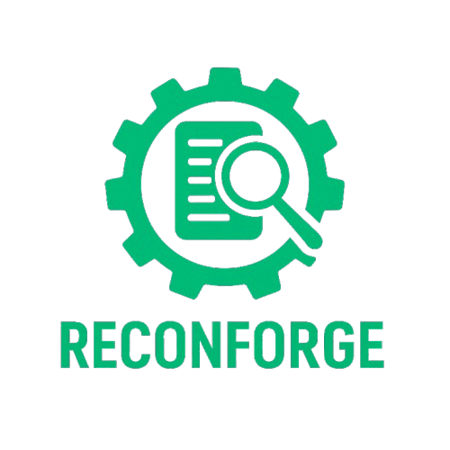

# 🔐 ReconForge — Intelligent Wordlist & Combo Generator



---

## 🧠 Overview

**ReconForge** is an advanced **custom wordlist & combo list generator** designed for cybersecurity professionals, red teamers, bug bounty hunters, and OSINT specialists.  
It intelligently mutates personal information like names, DOBs, locations, relationships, hobbies, and more — producing realistic and targeted password candidates.

> 💡 Combine multiple identities. Mix names, nicknames, dates, symbols, and cases to build smarter, deeper wordlists.

---

## 🎯 Features

- ✅ Multi-input support: names, nicknames, pets, hobbies, locations, mobile numbers, usernames
- ✅ DOB & important date variations (day, month, year, splits)
- ✅ Case style mutations: `camelCase`, `PascalCase`, `snake_case`, `kebab-case`, `UPPERCASE`, `lowercase`
- ✅ Symbol fusions: `@`, `_`, `-`, `.`
- ✅ Leetspeak, typos, reversals, suffixes
- ✅ Combo list generation: `username:password` style
- ✅ Depth control (light to aggressive mutation)
- ✅ Streamlit GUI & CLI interface
- ✅ Download-ready TXT files for wordlist and combos
- ✅ Full unit test coverage

---

## 🚀 Quick Start

### 🔧 Setup

```bash
git clone https://github.com/Kirubahar%20Balaji/reconforge.git
cd reconforge
pip install -r requirements.txt
```

---

### 🖥 Run the GUI

```bash
streamlit run gui_dashboard.py
```

> Fill in fields like names, nicknames, DOB, and click **Generate** to export the wordlist and optional combo list.

---

### 🧪 Use the CLI (Advanced)

```bash
python main.py   --names "john doe,linda smith"   --nicknames "jojo,lindz"   --pets "oreo,sparky"   --locations "newyork,manchester"   --hobbies "guitar,travel"   --mobiles "9876543210,7689456781"   --dob 23031995   --important-dates "04122000,14022018"   --usernames "jdoe,lindasmith"   --depth 3   --combo
```

---

## 📂 Output

ReconForge will generate files based on the primary name input.

Example: if name is `linda smith`, output will be:

- `lindasmith_wordlist.txt` — customized wordlist
- `lindasmith_combos.txt` — combo list (`username:password`)
- Download option from GUI combines both into a single archive

Each entry is mutated with:
- Casing styles
- Date fusions
- Symbol separators
- Leetspeak
- Reverse strings
- Typo logic

---

## 🧪 Testing

```bash
python test_reconforge.py
```

Includes test cases for:
- Leetspeak
- Date mutations
- Case styles
- Symbol fusions
- Combo formatting

---

## 🧩 File Structure

```
reconforge/
├── gui_dashboard.py        # Streamlit GUI
├── main.py                 # CLI Tool
├── generator.py            # Core logic
├── mutations.py            # All word mutations
├── input_parser.py         # Argument & input processing
├── combo_generator/
│   └── exporter.py         # Combo list generator
├── test_reconforge.py       # Unit tests
├── requirements.txt        # Dependencies
└── .github/workflows/
    └── tests.yml           # CI Workflow
```

---

## 🖼 Example Use Case

**Target:**  
- Name: *Linda Smith*  
- Nickname: *lindz*  
- DOB: *04/12/2000*  
- Pet: *Sparky*  
- Important Date: *14/02/2018*  
- Hobby: *Guitar*

✅ Output includes:

```
lindasmith
LindaSmith@2000
lindz_0412
sparkyGuitar
Linda-1402
guitar_sparky
linda@123
Sparky2000
...
```

---


## 🙌 Author

Built with ❤️ by **[Kirubahar Balaji](https://github.com/Kirubahar%20Balaji)**  
If this project helped you, consider giving it a ⭐ and sharing it with your team.

---

## 📄 License

This project is licensed under the [MIT License](LICENSE).